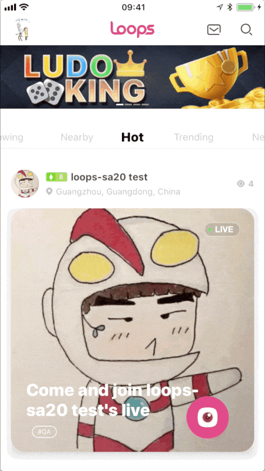
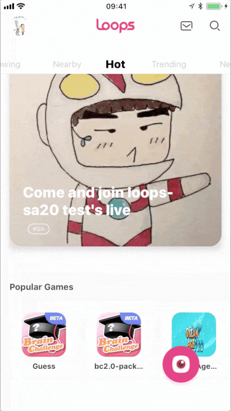
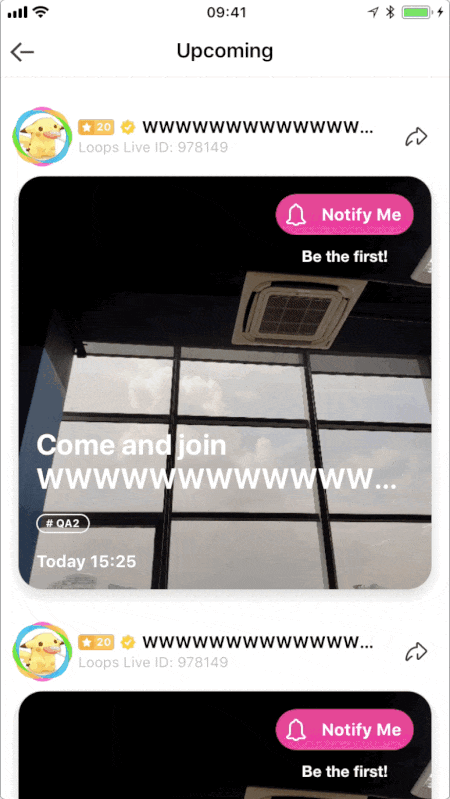

# Helping for Using This Forked Pod


There are three different style in Loops Live App.

- Updating with Loops logo animating;
- Updating with three dots animating;
- Loading more with three dots animating.


## Updating with Loops logo animating

There is a class called `MLLogoRefreshHeader` which inherits from `MJRefreshGifHeader`. Like its super class, it supports target-action mode and block, you can use it like this:

```Objective-C
// Target-Action
MLLogoRefreshHeader *header = [MLLogoRefreshHeader headerWithRefreshingTarget:self refreshingAction:@selector(action)];

self.tableView.mj_header = header;

// Block
MLLogoRefreshHeader *header = [MLLogoRefreshHeader headerWithRefreshingBlock:^{
    // do something here
}];

self.tableView.mj_header = header;
```


## Updating with three dots animating

There is a class called `MLDotsRefreshHeader` which inherits from `MJRefreshHeader`. Like its super class, it supports target-action mode and block, you can use it like this:

```Objective-C
// Target-Action
MLDotsRefreshHeader *header = [MLDotsRefreshHeader headerWithRefreshingTarget:self refreshingAction:@selector(action)];

self.tableView.mj_header = header;

// Block
MLDotsRefreshHeader *header = [MLDotsRefreshHeader headerWithRefreshingBlock:^{
    // do something here
}];

self.tableView.mj_header = header;
```



## Loading more with three dots animating

There is a class called `MLDotsRefreshFooter` which inherits from `MJRefreshBackFooter`. Like its super class, it supports target-action mode and block, you can use it like this:

```Objective-C
// Target-Action
MLDotsRefreshFooter *footer = [MLDotsRefreshFooter headerWithRefreshingTarget:self refreshingAction:@selector(action)];

self.tableView.mj_footer = footer;

// Block
MLDotsRefreshFooter *header = [MLDotsRefreshFooter headerWithRefreshingBlock:^{
    // do something here
}];

self.tableView.mj_footer = footer;
```




